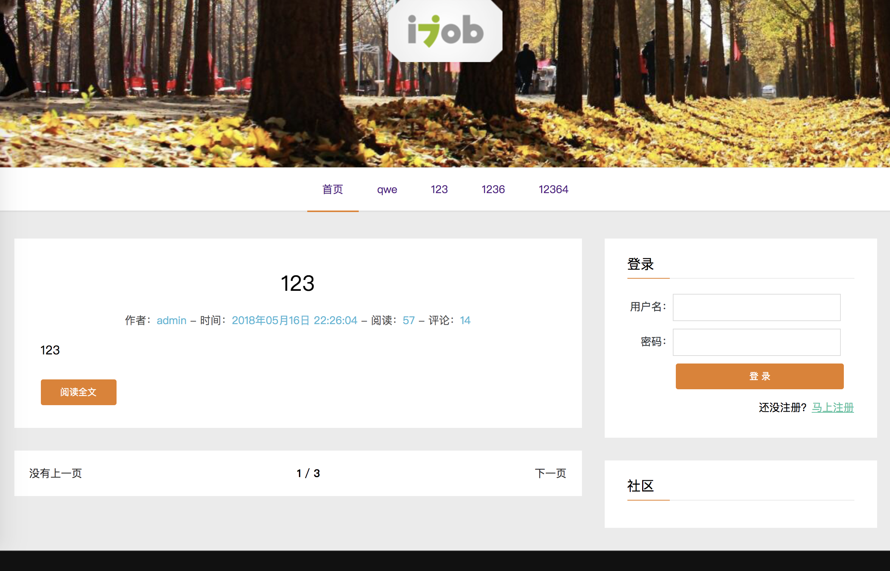

## 这是一个blog项目 


## 说明

<p>
如果对您有帮助，您可以点右上角 "Star" 支持一下 谢谢！ ^_^

或者您可以 "follow" 一下，我会不断开源更多的有趣的项目

如有问题请直接在 Issues 中提，或者您发现问题并有非常好的解决方案，欢迎 PR

同时也欢迎各位参与到这个项目中，共同完善这个项目
</p>

## 技术栈

node + express + redis + mongoDB


## 运行项目

<h3>启动数据库</h3>

``` bash

mongod --dbpath=数据库存放位置/db --port=27019(端口号)

```

<h3>连接指定数据库</h3>

``` bash

mongo localhost:27020/blog(数据库名称)

```

<h3>启动redis</h3>

``` bash

cd /usr/local/redis-4.0.11

> redis-server

```

<h3>启动项目</h3>

``` bash

node app.js

```
##  部分截图

<p>
  
</p> 


